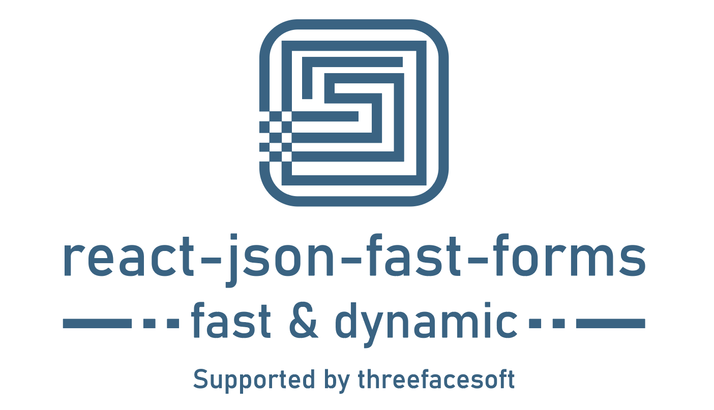

# react-json-fast-forms
[](https://www.npmjs.com/package/react-json-fast-forms)
[](https://bundlephobia.com/result?p=react-json-fast-forms)
[](https://npmjs.com/react-json-fast-forms)



React fast and dynamic form constructor.

## Introduction

🚀 This library is a comprehensive solution for creating dynamic forms based on the described structure.

👌 The design is implemented on top of antd, but there are plans to implement UI adapters to fine-tune the display.

## Install

```bash
npm install react-json-fast-forms
```
```bash
yarn add react-json-fast-forms
```

## Usage

🔧 At work...

## Component scheme props

| Property             | Type          | Description                                                        | Required? | 
|----------------------|---------------|--------------------------------------------------------------------|-----------|
| `id`                 | String        | The unique identifier of the component                             |     ✓     |
| `value`              | Object Config | The designation of the reference to the state property of the form |           |
| `render`             | Object Config | The displayed description of the component                         |           |
| `available`          | Object Config | List of child components                                           |           |
| `layout`             | Object Config | Layout settings                                                    |           |
| `async`              | Object Config | Read-only attribute                                                |           |
| `validate`           | Object Config | Component content                                                  |           |
| `components`         | String        | Image description                                                  |           |
| `type`               | String        | Type of component                                                  |     ✓     |

## Component scheme config

### Value
| Property       | Type         | Description | Required? | 
|----------------|--------------|-------------|-----------|
| `valueName`    | String       |             |           |
| `defaultValue` | String       |             |           |
| `path`         | String       |             |           |

### Render
| Property               | Type    | Description | Required? | 
|------------------------|---------|-------------|-----------|
| `label`                | String  |             |           |
| `values`               | Value   |             |           |
| `placeholder`          | String  |             |           |
| `multiple`             | Boolean |             |           |
| `content`              | String  |             |           |
| `alt`                  | String  |             |           |
| `source`               | String  |             |           |
| `text`                 | String  |             |           |
| `defaultRepetitions`   | Number  |             |           |
| `allowAddRemove`       | Boolean |             |           |

### Available
| Property                | Type          | Description | Required? | 
|-------------------------|---------------|-------------|-----------|
| `readonly`              | String        |             |           |
| `dependsCondition`      | JSON Function |             |           |

### Layout
| Property        | Type                      | Description | Required? | 
|-----------------|---------------------------|-------------|-----------|
| `labelCol`      | Number                    |             |           |
| `direction`     | vertical  \| horizontal   |             |           |
| `align`         | left \| center \| right   |             |           |


### Async
| Property             | Type                                                                         | Description | Required? | 
|----------------------|------------------------------------------------------------------------------|-------------|-----------|
| `type`               | fetch\/post \| fetch\/get \| gql                                             |             |           |
| `url`                | String                                                                       |             |           |
| `query`              | String                                                                       |             |           |
| `data`               | {intersectProcessing: JSON Function}                                         |             |           |
| `fetch`              | {onInit: Boolean, ifUndefined: Boolean, conditionFromDepends: JSON Function} |             |           |
| `depends`            | Array\<\{value: String, path: String \| String\[\]\}\>                       |             |           |
| `extractors`         | {value: JSON Function, label: JSON Function}                                 |             |           |

### Validate
| Property              | Type          | Description | Required? | 
|-----------------------|---------------|-------------|-----------|
| `required`            | Boolean       |             |           |
| `validateFunc`        | JSON Function |             |           |
| `min`                 | Number        |             |           |
| `max`                 | Number        |             |           |
| `step`                | Number        |             |           |
| `textReq`             | String        |             |           |
| `minLength`           | Number        |             |           |
| `maxLength`           | Number        |             |           |

#### Examples

The [examples](examples) folder contains working examples.
You can run one of them with.