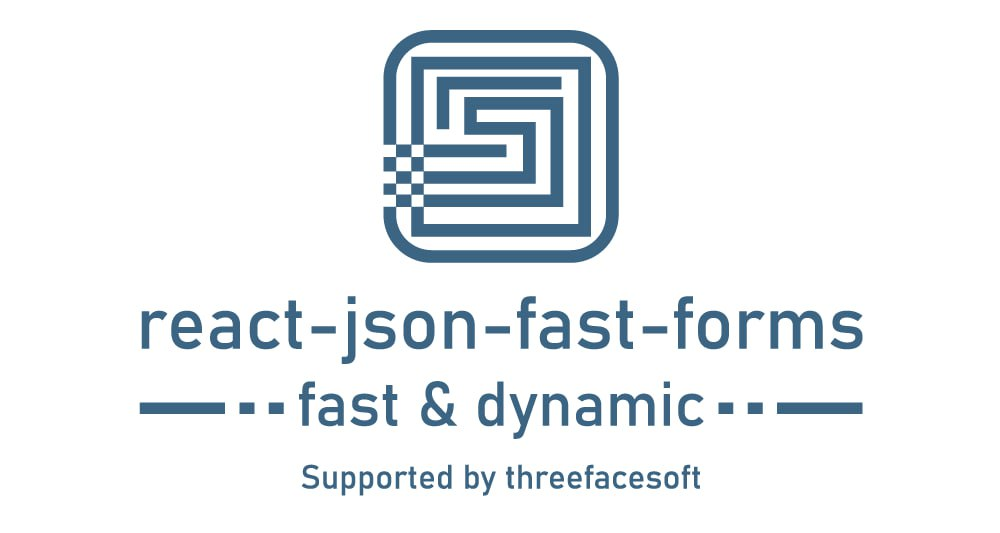

# react-json-fast-forms
[](https://www.npmjs.com/package/react-hooks-worker)
[](https://bundlephobia.com/result?p=react-json-fast-forms)



React fast and dynamic form constructor.

## Introduction

🚀 This library is a comprehensive solution for creating dynamic forms based on the described structure.

👌 The design is implemented on top of antd, but there are plans to implement UI adapters to fine-tune the display.

## Install

```bash
npm install react-json-fast-forms
yarn add react-json-fast-forms
```
## Usage

🔧 At work...

## Component scheme props

| Property                  | Type        | Required? | 
|---------------------------|-------------|:---------:|
| `id`                      | String      |     ✓     |
| `valueName`               | String      |           |
| `label`                   | String      |           |
| `components`              | Array       |           |
| `layout`                  | Object      |           |
| `readonly`                | Boolean     |           |
| `content`                 | String      |           |
| `alt`                     | String      |           |
| `source`                  | String      |           |
| `text`                    | String      |           |
| `values`                  | Array       |           |
| `path`                    | String      |           |
| `defaultRepetitions`      | Number      |           |
| `placeholder`             | String      |           |
| `allowAddRemove`          | Boolean     |           |
| `validate`                | Object      |           |
| `defaultValue`            | String      |           |
| `type`                    | String      |     ✓     |

#### Examples

The [examples](examples) folder contains working examples.
You can run one of them with.